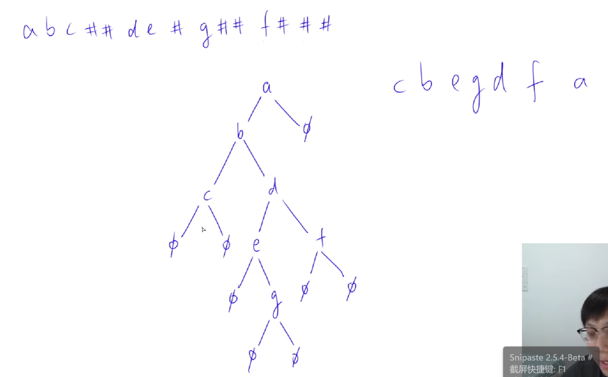
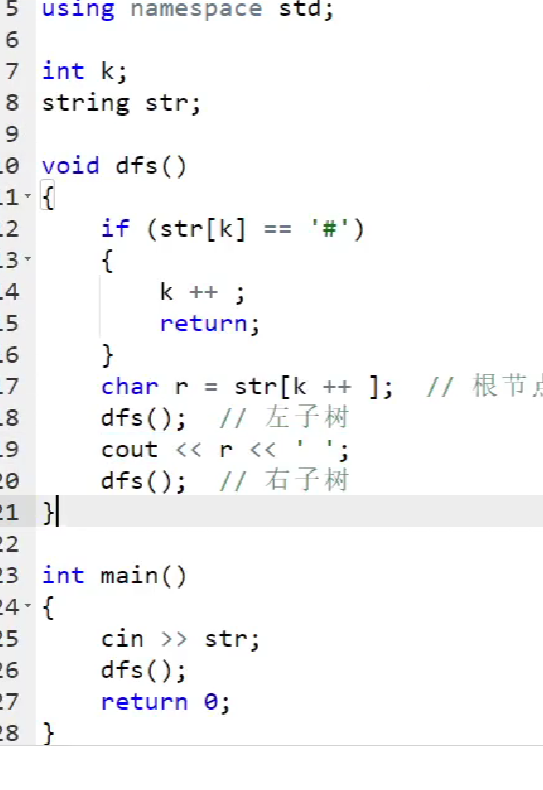
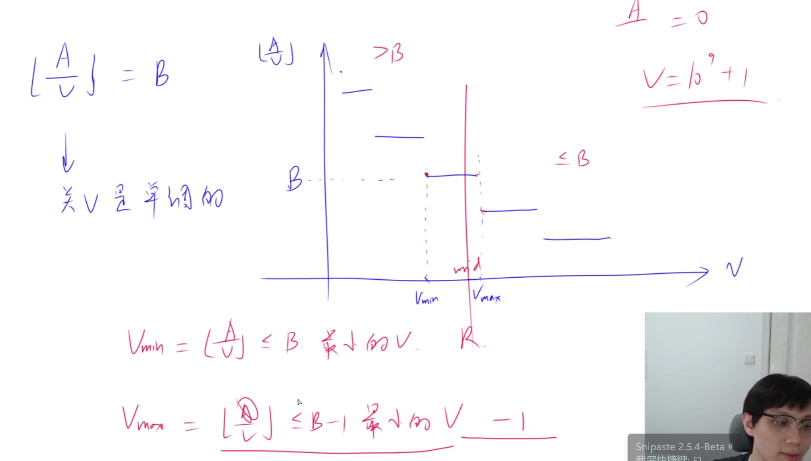
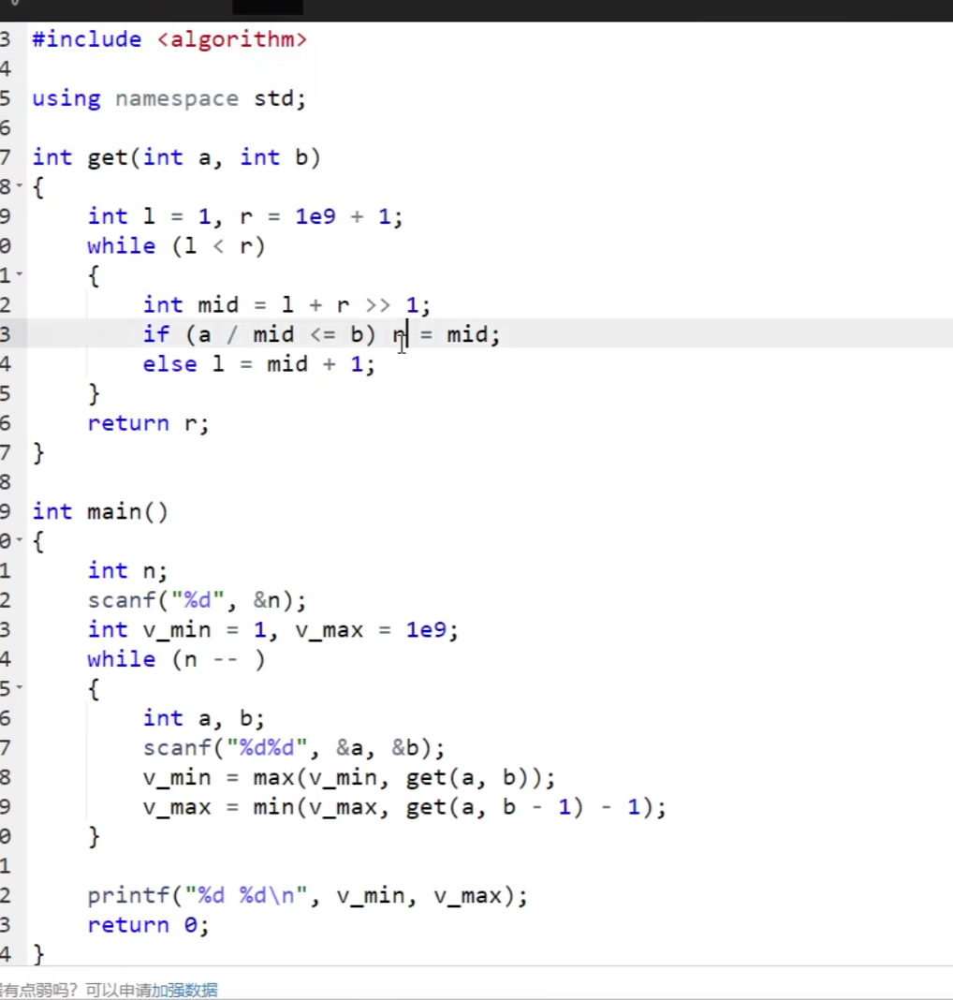

# 4.10~二叉树遍历

二叉树是一种重要的数据结构，其遍历方式有前序遍历、中序遍历、后序遍历三种。本文将分别介绍这三种遍历方式。

## 1.前序遍历


前序遍历是指先遍历根节点，然后遍历左子树，最后遍历右子树的过程。具体步骤如下：

1）访问当前节点。
2）遍历左子树。
3）遍历右子树。

代码实现：

```java
public void preorderTraversal(TreeNode root) {
    if (root != null) {
        System.out.print(root.val + " ");
        preorderTraversal(root.left);
        preorderTraversal(root.right);
    }
}
```

## 2.中序遍历

中序遍历是指先遍历左子树，然后遍历根节点，最后遍历右子树的过程。具体步骤如下：

1）遍历左子树。
2）访问当前节点。
3）遍历右子树。

代码实现：

```java
public void inorderTraversal(TreeNode root) {
    if (root != null) {
        inorderTraversal(root.left);
        System.out.print(root.val + " ");
        inorderTraversal(root.right);
    }
}
```

## 3.后序遍历

后序遍历是指先遍历左子树，然后遍历右子树，最后遍历根节点的过程。具体步骤如下：

1）遍历左子树。
2）遍历右子树。
3）访问当前节点。

代码实现：

```java
public void postorderTraversal(TreeNode root) {
    if (root != null) {
        postorderTraversal(root.left);
        postorderTraversal(root.right);
        System.out.print(root.val + " ");
    }
}
```

以上就是二叉树的前序遍历、中序遍历、后序遍历的讲解和代码实现。这三种遍历方式在树的操作中经常使用，可以根据具体的需求来选择使用哪种遍历方式。


不给空子树位置时

前 + 中 序遍历

后 + 中 

可确定 唯一一颗 二叉树


 



# 4.11~冶炼金属




