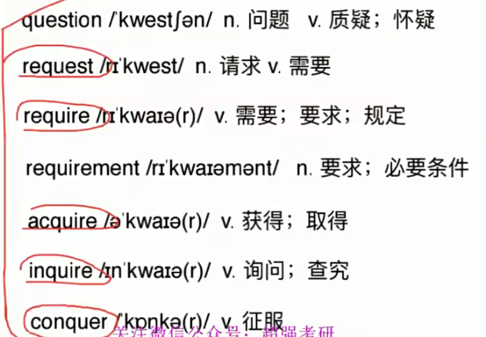
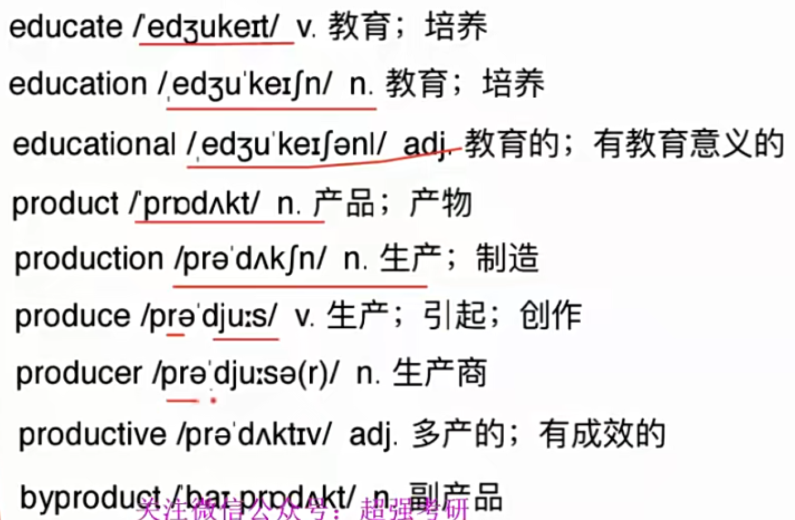
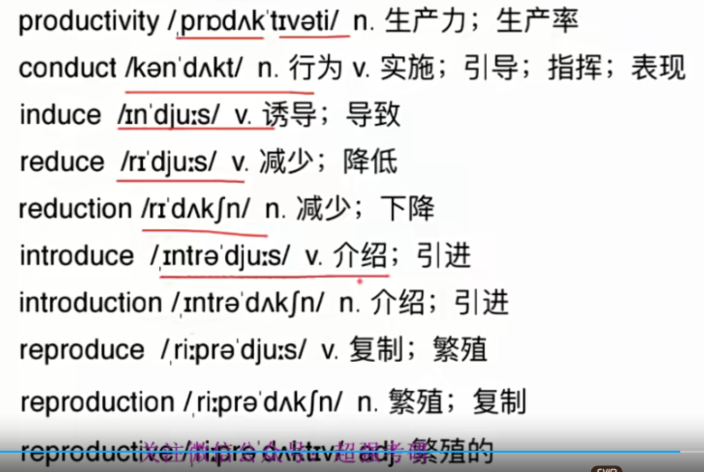

词根词缀 + 语境

听课方法: 课上理解 , 课下听回放

## 1. view (看;被看见的)

**view (see)** 

​	v. 认为 n. 观点;风景

**re- 再一次**

​	**review**   (再看)

​	n.v. 回顾; 复习; 评论

**inter- 相互**

​	**interview** (相互看)

​	n.v.采访; 面试; 面谈;

​		-ee 承受者 interviewee , employee

​		-er 发出者 interviewer , employer

​	

## 2. quire/quest/quer (to ask 询问, to seek 寻找)

**question**

​	n. 问题 v**. 质疑; 怀疑**

​	-tion

**resquest** 

​	n.v 请求; 需要  (**“请”**)(正式客气**guest**)

​	our final resquest 

​	

**require** 

​	n.v 需要; 要求 (== **need**)

​	requirement n. 要求; 必要条件

​	meet the requirements 满足条件

**ac- a+辅音字母  强调**

​	acquire 

​		v. 获**得**; 取**得**; 学**到**(知识;技能); 

​		不断学习, 不断获得到的

​		acquire knowledge 

**in- 进来 , 向内**

​	 inquire 

​		v. 询问; 查究

**con- 共同, 强调**

​	conquer == overcome

​		v. 征服 

​		(谐音,坎坷)

## 3. duce/duct/duc (to lead 引导; 拉)

**pro- 向前**

​	produce v. 生产; 引起; 创作  (向前拉)

​	productive adj. 多产的; 有成效的

​		productive workers 高效的工人

​		prodective meeting  有成效的会议

​	productivity n. 生产力; 效率

​	byproduct n. 副产品 (中性词)

​		by-旁边

​	side effice 副作用 (中心词)

**e- (ex-)**  出(out)

​	**educate** v.教育; 培养

​	

​	teach “教”,具体知识技能

​	educate 广泛教育,言传身教,影响熏陶

​	train 训练,培养

​	tutor 一对一

con- 共同, 强调

​	**conduct** “一起lead”

​		n. **行为**

​		v. **实施**; 引导; 指挥; 经营; 传(热,电)

​		conduct business 做生意

​		hurt by her conduct 被她行为伤害

in- 进来, 内向

​	induce 

​		v. 诱导, 劝说 == persuade ; 导致 == cause

​		some drugs will induce sleep. 有些药物使人昏昏欲睡( == cause)

​	impose 强加

​		-pose == put

​	

re- 向后, 往回

​	reduce 

​		v. 减少; 降低

​		reduce the speed 减速

re- 再

​	reproduce v.复制; 繁殖

​	reproduction n.复制; **繁殖**

​	reproductive adj. 繁殖的 

​	

intro- 在内, 向内 (within)

​	re- == retro-

​	in- == intro- 高级

​	

​	intro-duce v. 介绍; 引进

​		关键词“引” (to lead)

​	introduction n.介绍; 引进; 前奏; 序言

​	

​	

	

## 4. fess( to say, to talk 说)

professor n. 教授; 教师

​	“向前说”

profession n. 职业, 专业; 声明

​	-sion 名词词尾

professional 

​	adj. 专业的; 职业的  

​	n.   **专家; 专门人才**

​		health professional 健康方面专家

confess 忏悔 

​	“全说”

## 5. just/jur/jud (law 法律 ,right 正义)

Justitia 正义女神

just 

​	adj. 公正的, 合理的; 正直的

​	adv. 只是; 刚才

​	a just decision 一个公正的决定

justice 

​	-ce 名词词尾

​	n. 公平 , 公正

justify 

​	v. 证明正确; 替..辩护(解释)

​	-fy 动词词尾 , 使得其..

​	错误的事 辩护  

​	justify a war 证明战争合理性

adjust

​	“朝向 正义的方向”

​	v. 调整 ; 校准

​	adjust your speed 调整车速

​	adjustment n. 调整, 调节

injure 

​	in- 否定

​	v. 伤害, 损害

​	 He injured his knee. 他膝盖受伤

​	

​	injury n. 伤害, 损害

judge

​	n. 法官; 裁判员 “ 判断正义的人”

​	v. 判断; 裁判; 评价

​	a High Court judge 高等法院法官

​	关键词 “裁””判”

