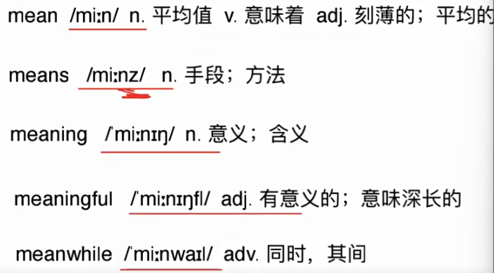
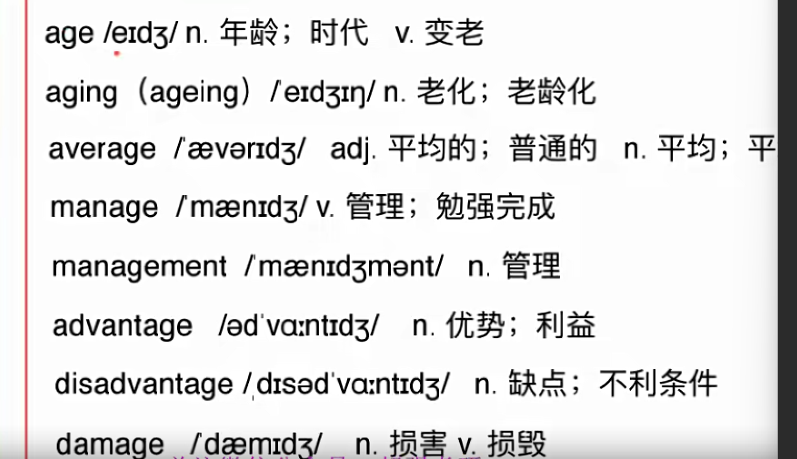
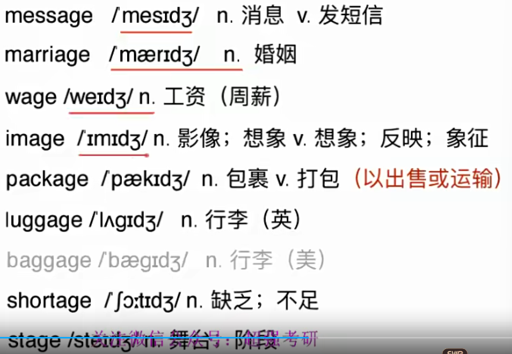

# 词汇02

## 6. mean (中间的)

mean 

​	n. 平均值

​	v. 意味着

​	adj. 刻薄的; 平均的

​		What do you mean? 你什么意思?

​		6 is the mean 3,7 and 8.  6是3,7,8的平均数

​		the mean temperature 平均气温

​		You are so mean! 你很刻薄

means 

​	n. 手段; 方法 (你和目的的 中间的 桥梁)

​		单复数同行 

​		all possible means 所有可能的方法

​		every possible means 每一种可行的方法

​		by no means 没有办法

meaning n. 意义; 含义

meaningful adj. 有意义的; 意味深长的;

meanwhile adv. 同时,期间

​	Meanwhile,

## 7 . -age

age 

​	n. 年龄; 时代

​	v. 变老

​		Stone Age. 石器时代

​		People age. 人是会衰老的.

​			一般现在时 -- 规律,性质 “不受时间影响”	

​			现在完成时 -- 已经

aging (ageing) n.老化; 老龄化

​	aging process 衰老过程

​	

average 

​	adj. 平均的; 普通的

​	n. 平均; 平均数

​		average speed 平均速度

​		average student 普通学生

manage v. 管理; 勉强完成

​	**	** hand 手

​	manage a factory 管理一个工厂

​	**manage to** persuade him 设法(成功)说服他

​		强调 to 后

​	I can manage another piece of cake.

​		我还能再吃一块

​	I can manage to kill him.

​		我千辛万苦杀了他. 我设法杀了他

management n. 管理

advantage n. 优势; 利益

​	advance- 前进 

​	take advantage of sth.sb.   充分享用;占便宜;

​		“把好处拿走”

​	He took advantage of me.他利用了我.

​	We took full advantage of the hotel facilities.

​		我们充分享用了旅馆设施.

disadvantage n. 缺点; 不利条件

damage 	

​	n. 损害 

​	v. 损毁 

​	damn 诅咒

​    serious damage 严重损坏

​		“ 强调损 ”

​	destroy “强调坏”

message 

​	n. 消息

​	v. 发短信

​	**mess- / miss-** == to send(送), to throw (投; 掷)

​		Please leave a message. 请留下的的信息.

​		Tom just messaged me. 汤姆刚给我发来短信.

​				texted me.(美) 

marriage n. 婚姻

wage

​	wage(按周/天发钱)

​		社会相对下层	

​		weekly wage 周薪

​		minimum wage 最低工资

​	salary(按月发钱)

​		salt盐 古罗马士兵发钱 会先去买盐

​		an annual salary 年薪

​		monthly salary   月薪

​	income(收入,所得)

​		所有得到的,捡来的,利息..

​		high**er** /middle/ lower income

​		高,中等,低 收入

image

​	n. 影像; 想象;	“一个样子”

​	v. 想象; 反映; 象征

​		public image 公众形象 “人设”

  	  a wooden image 一个印在木头上的形象

package 

​	n. 包裹

​	v. 打包 (用以出售或运输)

​		There is a large package for you.

​		你有一个大包裹

luggage n. 行李 (英) “谐音:拉个..”

​	baggage n. (美)

​	a lot of luggage 

​	two pieces of luggage  两件行李

​	(同几张纸) 不可数 

shortage n. 缺乏; 不足

​	There is no shortage of money here . 不缺钱

stage n. 舞台; 阶段

​	the political stage 政治舞台

​	early stage 早期阶段

​	

​	**大量介词名词 在英语中 高级**

		

## 8. techn (art/skill  技术/技艺)

technology n. 科技;技术  “ 强调‘**科**学’”

technological adj. 科技的; 工艺的 ; 技术的

​	Information Technology 信息技术

​	technological advances “-s” “各方面的”科技进步

​	

technique n. 技巧; 技术 “ 强调‘**技**’,熟练度”

technical adj. 技能的; 专门技术的

​	painting technique 绘画技巧

​	technical support 技术支持

technician n. 技术员 “不需要很高技术”

## 9 . fer (to carry 拿来 , to bring 带来)

offer 

​	v. 提供  n. 工作邀请

​	**of- 朝向**

​	accept/refuse an offer 接受/拒绝 好意	

​	

refer v. 查阅; 参考; 提及; 

​	“ 一再的拿出来”

​	refer to 

​		He never referred to him. 他从没有提起过他. 

​		refer to my note  查阅笔记.

​	refer to A as B 

​		把A称作B

​		The report **refers to** this **as** the coming of the “18-hour-city” , and uses the term to **refer to** cities like..

reference n. 参考

differ v. 不同于

​	== be different 

​	French differs from English.

​	French and English differ.

​		法语不同于英语.

indifferent adj. 漠不关心的

​	“你想吃什么”“都行,没有什么不同”

​	an indifferent society 一个冷漠的社会

prefer v. 较喜欢

​	pre- : before 先

​	“先 拿”

​	

​	

preference n. 偏爱; 偏好

suffer v.受苦; 遭受

​	sub- (suc- suf- sug- sum- sup- sur- sus-) == under 在下面

​	“在下面词根都有忍着的感觉”

​	sustain - 维持

​		sus- -tain(hold)

​	

​	He suffers. 他很痛苦.

​	He suffers from depression. 他患有抑郁症.

​	

conference n. 会议

​	“一起 带来”

​	大会(持续好几天) 

​	meeting (碰头会)

​	congress “一起走路” 路线 - 中国人民代表大会 ; 国会	

infer v. 推断

​	“里面拿出来”

​	

interfere v. 干涉

​	**inter-** between/ among 在..之间

​	“ 拿到 中间”

​	interfere in “在内部插手”

​    interfere with  “影响”

​	

interference n. 干涉

transfer “转移”

​	n. 转移; 换乘

​	v. 转学, 调动; 转移

​	**trans- : “冲A到B”**

​	He transferred to UCLA. 转学

​	transfer station 换乘站

## 10. lead( 引领, 领导)

leader n. 领导者

lead n. 领先地位 v. 领导; 引导;

​	Smoking leads to health problems. 吸烟引起健康问题

​	She took/lost the lead. 她领先,落后.

leading adj. 最重要的; 领先的 ==top

​	“直接跪下”

​	leading experts 杰出的专家

leadership n. 领导; 领导地位

​	fight for the leadership 争夺领导地位

mislead v. 误导

​	mis- 

misleading adj. 误导的

​	misleading message

​	

