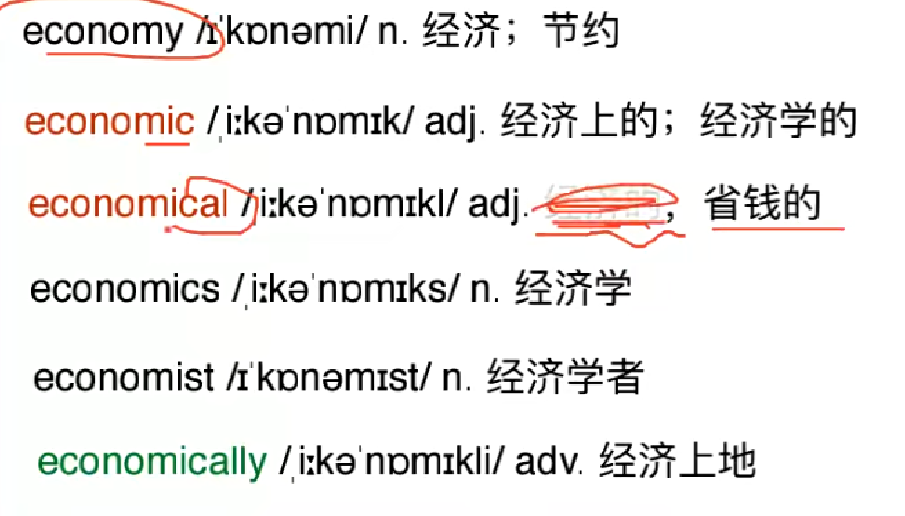
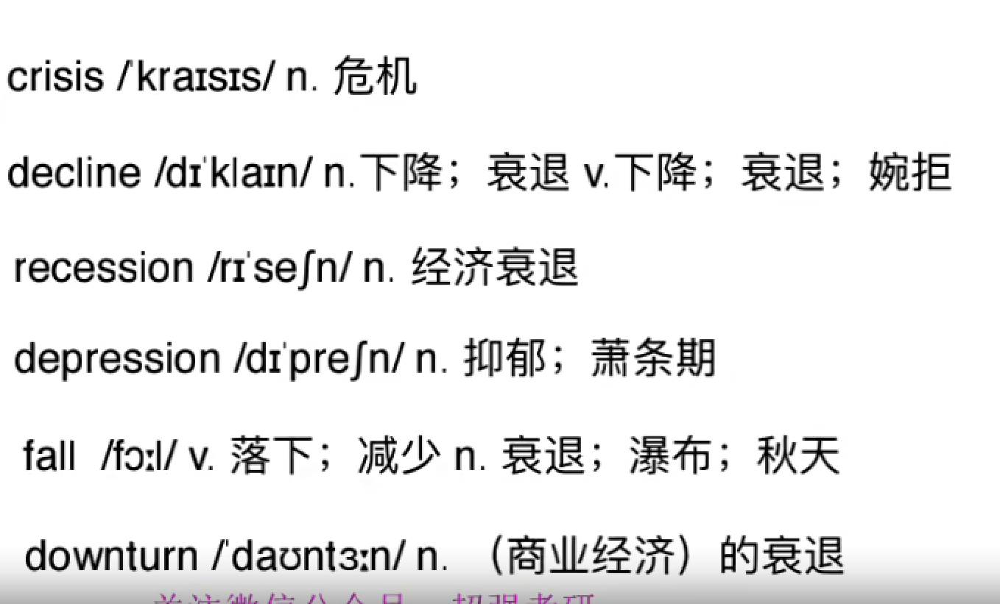
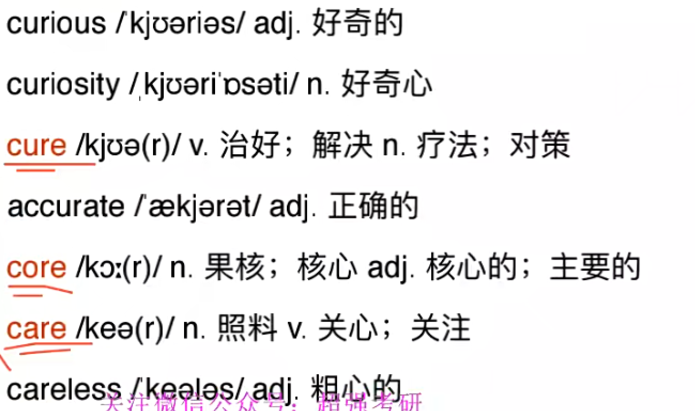
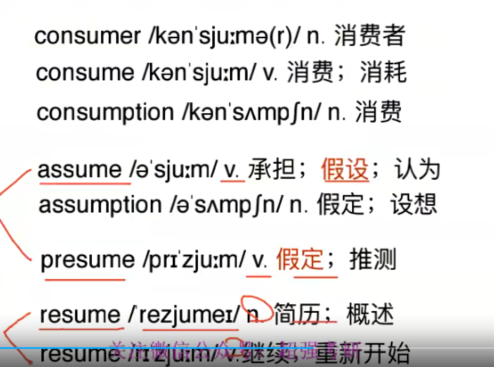
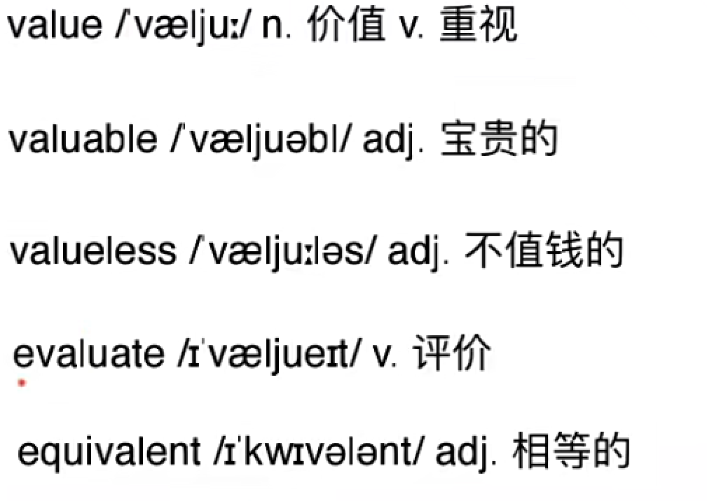
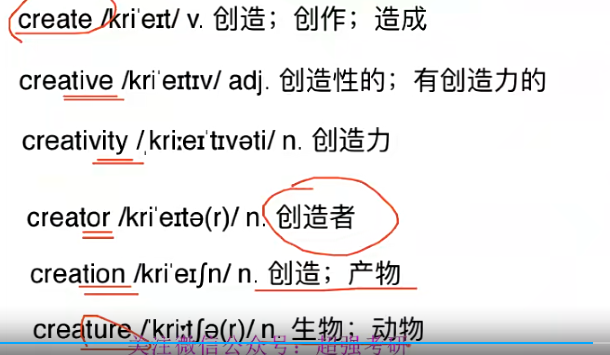
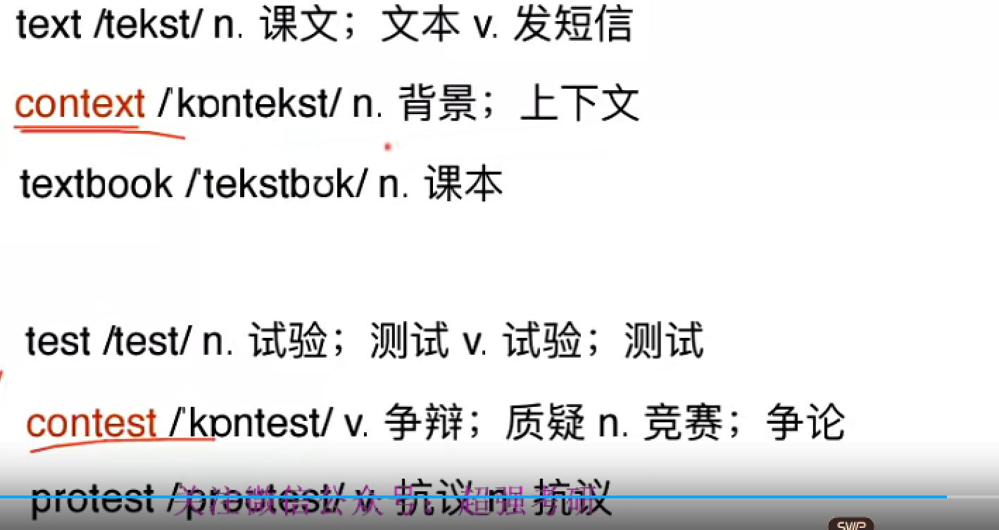
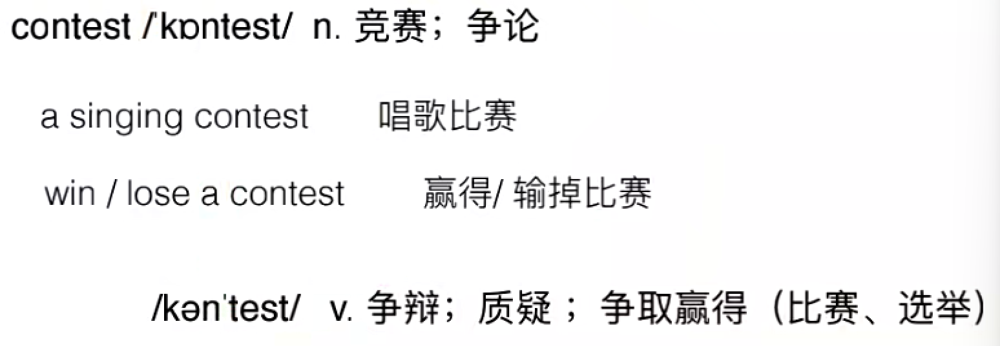
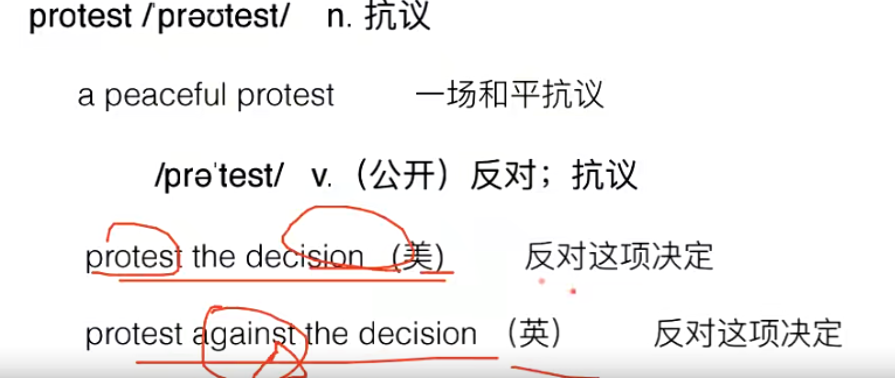
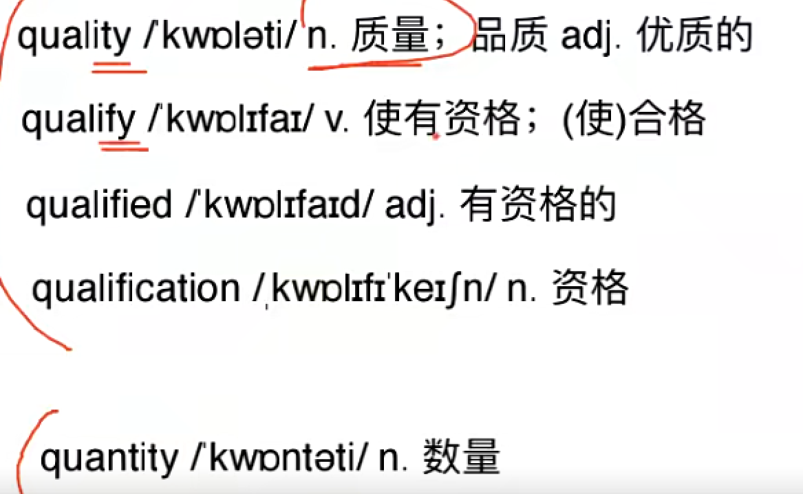

# 词汇03

## 11. 经济

economy n.经济; 节约

​	“依靠农民”

​	a market economy 市场经济

​	economy class 经济舱 != 便宜 强调资源充分利用

economic adj. 经济上的; 经济学的

​	“带经济的都与这有关”

​	economic policy 经济政策

economical adj. 省钱的 “ 抠”

​	an economical car 节油型汽车

​	he is economical   他精打细算

economics n. 经济学

​	-ics 学科结尾 -ology

​		physics 体育

​	

economist n. 经济学者

economically adv. 经济上地

​	support sb. economically

## 12. 衰退

crisis n. 危机

​	“危险蕴藏着机遇”

decline “向下倾斜”

​	n. 下降; 衰退 

​	v. 下降; 衰退; 婉拒	

​	a rapid decline 迅速下降

​	refuse/ decline his help 断然拒绝/ 谢绝帮助

recession n. 经济衰退

​	cess/ ceed/ cede (行走)

​	re- 向后,回 cess 行走

​	The economy is in recession.  经济处于衰退之中.

depression n. 抑郁; 萧条期

​	de- 向下 + press- 压, 压制

​	“向下压人/经济”

​	She suffered from depression . 她罹患忧郁症.

​	economic depression 经济萧条期

fall

​	v. 落下; 减少 

​	n. 衰退; 瀑布; 秋天

​	The rain was falling . 雨不停地下着

​	in the fall of 2020 在2020的秋天

​    Niagara Falls 尼亚加拉瀑布(群)

downturn n. (商业经济) 的衰退

​	

## cur/ cor/ car (关心, 照料)

curious 

​	adj. 好奇的; 稀奇古怪的

​	“关心才会好奇”

​		a curious boy 充满好奇心/古怪的小男孩

​		Stay hunger . Stay curious . 保持求知, 保持好奇.

​	

curiosity n. 好奇心

​	out of curiosity 出于好奇

​	

cure 

​	“强调治好”

​	v. 治好; 解决

​	n. 疗法; 对策

​		cure him 治好他

​		a cure  for poverty 解决贫穷的措施

accurate	adj. 正确的

​	“对事情非常关心, 自然就是做的对的”

core	

​	n. 果核; 核心

​	adj. 核心的; 主要的

​		the earth`s core 地核

​	hardcore 

​		n. 核心 adj. **绝对的**,无条件的

​		hardcore fan 铁杆粉丝/脑残粉

​	core value**s** 核心价值观

​	

care	

​	n. 照料

​	v. 关心; 关注

​	care for == love “特别关心就成了爱”

​	who cares.

careless	adj. 粗心的

​	

## 14. sume (to take 拿, to use 用)

consumer n. 消费者

consume v. 消费; 消耗

​	“中性词”

​	“全拿走,全用了”

​	consume energy 消耗能量

consumption n. 消费“过程”; 消耗 ,消耗量“结果”

​	food consumption 食物消耗(量)	

assume v. 承担; 假设“去拿过来”; 认为 

​	“没有证据的臆测”

​	“== to take”

​	I will assume this responsibility. 我将承担起这个责任

​	

assumption n. 假定; 设想

​	

presume 

​	v. 假定; 推测 “ 有一定证据的推测”

​	“事先拿到”

​	It is very expensive , I presume?我想, 这很贵吧?

​		“已经看见LV包了” 

​	It is very expensive , I assume?

​		瞎猜的

resume n. 简历; 概述

​	resum`e 

​	personal resume 个人简历

resume v. 继续; 重新开始

​	resume her career 返岗

​	The noise resumed 噪声又响了起来.

## 15. valu (价值)

value n. 价值 v.重视

​	I value him as a friend. 我把他珍视为朋友.

​	

valuable adj. 宝贵的

​	valuable memorie**s** 宝贵记忆“们”

​	 	

valueless == worthless adj. 不值钱的

evaluate v. 评价

​	“经过思考的评估”

​	evaluate the risk 评估风险

​	“ e-out 价值出来”

equivalent 

​	equal valu lent

​	adj.相等的

​	n. 等价物

​	a和b相等 

​		a is equivalent to b

​		a equals b

评估 评价

estimate n. **估计**

​	(估计)

​	未经计算的大概估价

​	The tree is estimated to be 200 years ole.

​		这颗树大概200岁.

assess v. 评定; 评估

​	(测评) “考验考公”
​	(formal)评估能力，损失，价值等，以便确定下步行动
​	assess the damage 评估损失

rate v.评价；评估 n.比率；速度；费用
	(评级)
	仅评定等级的高低“几颗星”

​	They rated him highly. 	

​	

## cre( to grow 生长)

create v. 创造;  创作; 造成 

​	( 从无到有)

​	create more jobs 创造更多就业

creative adj. 创造性的; 有创造力的

​	creative thinking 创新思维 事	

​	She`s very creative. 她极富创造力 人

creativity n. 创造力

creator	n. 创造者

creation	n. 创造; 产物

creature n. 生物; 动物

​	被创造出来的生物 “ 外星人,孙悟空”

​	

## 17. text/ test (编制/ 证据, 验证)

texture 纹理

textile 织物

context 

​	n.  课文; 文本

​	v.  发短信

​	“编 文本”

​		Text me later.稍后发我短信 “编”

​		message me later. “ 发”

context n. 背景 ; 上下文

​	“全编到一起 一块布” => 背景

​	social context 社会背景

test 	

​	“证据, 验证”

​	n. 实验; 测试 

​	v. 试验; 测试

​	pass / fail **a** test 通过/没有通过测验

​		‘可数名词’

​	“ **所有测验 ** 都可用test ”

contest 发音名前动后

​	n. 竞赛; 争论

​		“一起测试,验证”

​		win **a** contest 赢了比赛

​	v. 争辩; 质疑; 争取赢得 (比赛, 选举)

	 	 

protest 

​	“ 向前 验证,证明”

​	n. 抗议

​	v. 反对; 抗议

​		protest the decision 反对这项规定

## 18 . quality 质量 / quantity数量

 

 quality 

​	n. 质量; 品质

​	adj. 优质的

​	the quality of life 生活的品质

​	quality life 优质生活, 高质量的时光

qualify v. 使有资格; 使合格

​	This training will qualify you.

​	这次培训将使你获得资格.

qualified adj. 有资格的

​	“考了证了”

​	a qualified teacher

​		“不证明教的好”

​	be qualified for sth /to do sth.

​		He is qualified for the job.

​		He is qualified to do the job.	

​		他有资格去做这项工作.

qualification n. 资格

​	

quantity n. 数量

​	 quality and quantity 质量和数量

​	 a large quantity of food/drugs 大量食物毒品

